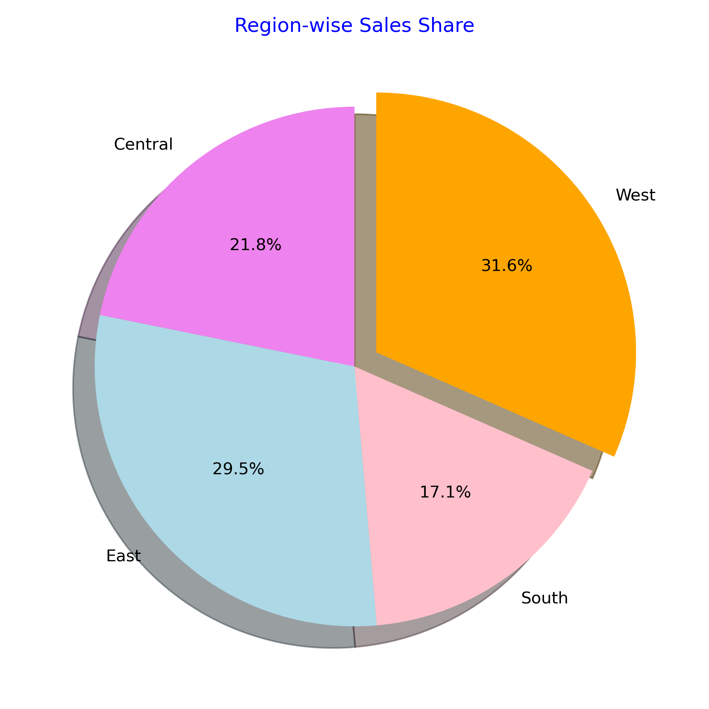
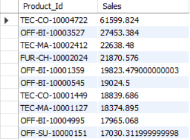
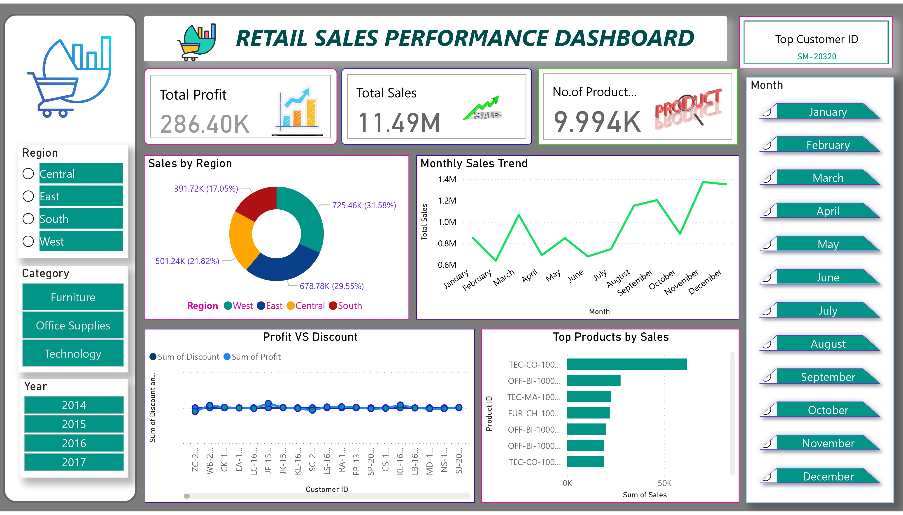

# 🛍️ Retail Sales Performance Analysis  
Developed an interactive data analysis project to evaluate retail sales performance across regions, categories, and time periods. Collected a dataset from Kaggle, cleaned and visualized data to identify top products, regions, and customers, highlighting key insights for data-driven decisions.

An **interactive data analytics project** that evaluates and visualizes retail sales performance across regions, categories, and time periods.  
Using **Python, SQL, Power BI**, this project delivers **actionable insights** for **data-driven decision-making**.

---

## 📊 Project Overview  

This project analyzes retail sales data to uncover:  
- 🌟 Top-performing products and regions  
- 🛒 Customer purchasing behavior  
- 📈 Sales and profit trends over time  
- 📌 Key performance metrics (KPIs) for business growth  

The dataset was collected from **[Kaggle](https://www.kaggle.com/)**, cleaned, and transformed for visualization using analytical tools.

---

## 🧰 Tools & Technologies  

| Tool | Purpose |
|------|---------|
| 🐍 **Python** | Data cleaning, preprocessing, and analysis |
| 🗃️ **SQL** | Querying and extracting data |
| 📊 **Power BI** | Interactive dashboards and visualizations |

---

## 📈 Key Insights  

✅ Region-wise performance trends  
✅ Category and sub-category profit distribution  
✅ Top 10 products by sales and profit  
✅ Discount vs. sales impact analysis  
✅ Monthly and yearly sales comparisons  

---

## 🖼️ Dashboards & Visuals  

### 🗓️ Monthly Sales and Profit Trends  
<p align="center">
  
</p>

### 📦 Top 10 Products by Sales  
<p align="center">
  
</p>

### 📊 Interactive Dashboard Overview  
<p align="center">
  
</p>

*Note: Replace the image paths with your actual images from the `Images/` folder.*
### 🔗 View Full Power BI Dashboard Online  
[Click here to open the Power BI Dashboard](https://app.powerbi.com/links/z3I7GGoLO3?ctid=efd5b06c-ccb0-46eb-a8db-887c4a53da3c&pbi_source=linkShare)
---

## 🧾 Dataset  

- **Source:** [Kaggle - Superstore Sales Dataset](https://www.kaggle.com/)  
- **Format:** `.xlsx` / `.csv`  
- **Size:** ~10,000 records  

---

## 🧠 Learnings  

- 🧹 Data cleaning using Python and Excel  
- 🗂️ SQL queries for extracting and summarizing insights  
- 📊 Power BI dashboard creation  
- 📌 Interpreting business performance metrics  

---

## 🚀 How to Run  

1. Clone this repository:  
   ```bash
   git clone https://github.com/chandra9398/Retail-Sales-Performance-Analysis.git
